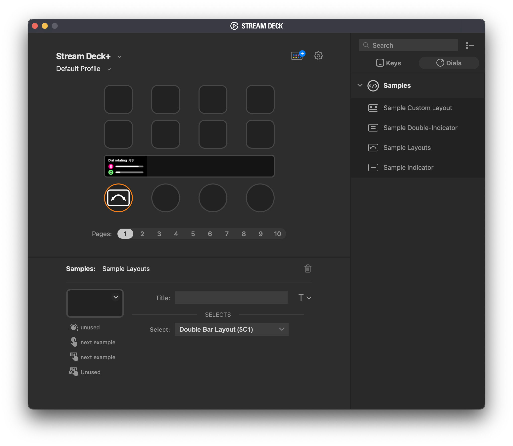

# A Sample Layouts Stream Deck Plugin

This SDK-example shows how to use:
- layouts (built-in and custom)
- setFeedbackLayout
- setFeedback
- load layout from file
- load icons from file
- create icons using svg

## Changes:
### 0.1.0.05
- removed type `placcard` from [customlayout.json](src/com.elgato.sample-customlayout-plugin.sdPlugin/layout/customlayout.json)
- changed property `z-order` to `zOrder` in [customlayout.json](src/com.elgato.sample-customlayout-plugin.
